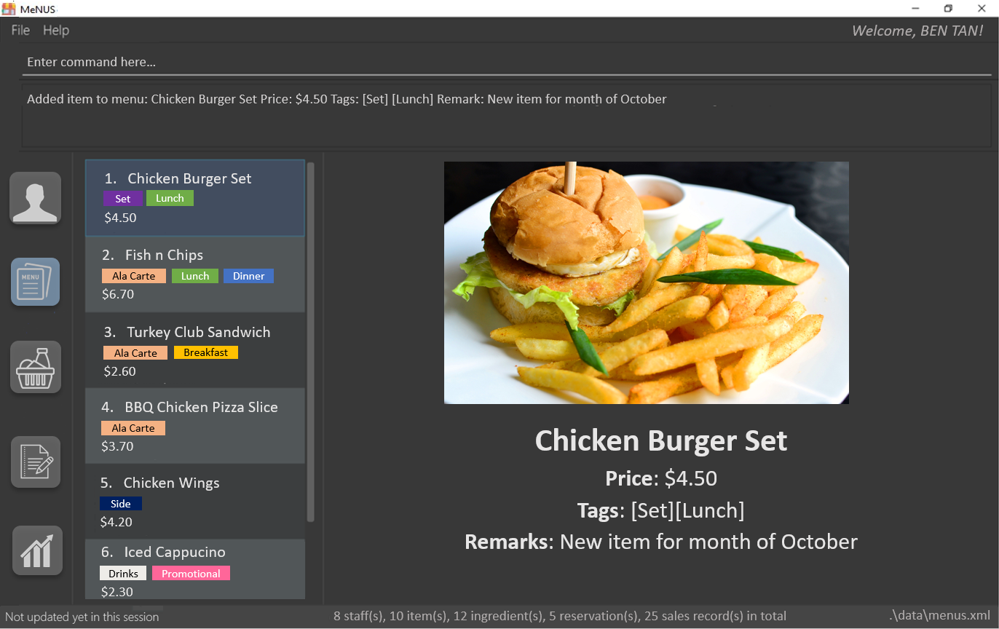

= MeNUS
ifdef::env-github,env-browser[:relfileprefix: docs/]

_Improves the **m**anagement and its **e**fficiency of your restaurants in **NUS**._

https://travis-ci.org/CS2103-AY1819S1-F10-4/main[image:https://travis-ci.org/CS2103-AY1819S1-F10-4/main.svg?branch=master[Build Status]]
https://ci.appveyor.com/project/AZhiKai/main-j2jk6[image:https://ci.appveyor.com/api/projects/status/5kwkxt5khmfo0q31/branch/master?svg=true[Build status]]
https://coveralls.io/github/CS2103-AY1819S1-F10-4/main?branch=master[image:https://coveralls.io/repos/github/CS2103-AY1819S1-F10-4/main/badge.svg?branch=master[Coverage Status]]
https://www.codacy.com/app/AZhiKai/organisation_main?utm_source=github.com&amp;utm_medium=referral&amp;utm_content=CS2103-AY1819S1-F10-4/main&amp;utm_campaign=Badge_Grade[image:https://api.codacy.com/project/badge/Grade/299f6df960044215a511a90d281af954[Codacy code quality]]

ifdef::env-github[]

endif::[]

ifndef::env-github[]
image::images/Ui.png[width="600"]
endif::[]

* This is a desktop menu application. It has a GUI but most of the user interactions happen using a CLI (Command Line
Interface) which is oriented for typist user.
* The target user group is F&B owners who operate one or more restaurants in NUS. This application aims to improve
the effectiveness and efficiency of managing their restaurants.

== Site Map

* <<UserGuide#, User Guide>>
* <<DeveloperGuide#, Developer Guide>>
* <<AboutUs#, About Us>>
* <<ContactUs#, Contact Us>>

== Acknowledgements

* This application was built based on https://github.com/se-edu/addressbook-level4[Address Book (Level 4)], an
initiative of the https://se-edu.github.io/Team.html[se-edu] team.
* Some parts of this sample application were inspired by the excellent http://code.makery.ch/library/javafx-8-tutorial/[Java FX tutorial] by
_Marco Jakob_.
* Libraries used: https://github.com/TestFX/TestFX[TextFX], https://bitbucket.org/controlsfx/controlsfx/[ControlsFX],
 https://github.com/FasterXML/jackson[Jackson], https://github.com/google/guava[Guava],
 https://github.com/junit-team/junit5[JUnit5], https://github.com/patrickfav/bcrypt[bcrypt]
* Free icons: https://www.flaticon.com/authors/smashicons[Smashicons], https://thenounproject.com/term/my-account/219377/[User account icon],
http://free-icon-rainbow.com/restaurant-menu-free-icon-3/[Menu icon], http://www.iconarchive.com/show/ios7-icons-by-icons8/Food-Bunch-Ingredients-icon.html[Ingredient icon],
https://icons8.com/icon/pack/city/dotty[Reservation icon], https://mbtskoudsalg.com/explore/sales-icons-png/[Sales icon], http://img.grouponcdn.com/deal/6116wnYU3ci3GdedPMKw/hE-1000x600[Chicken Burger Set photo]

== Licence : link:LICENSE[MIT]
